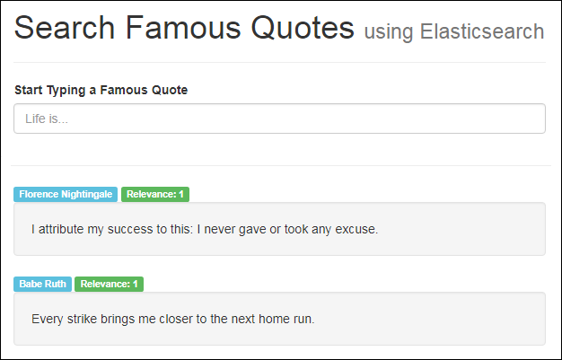

# basic-elasticsearch
A basic demonstration of using Elasticsearch to render search results.

See the live demo at [35.196.93.111/elastic](http://35.196.93.111/elastic/)

  

The REST API can be accessed at this endpoint: [35.196.93.111/api/search_famous_quotes.py](http://35.196.93.111/api/search_famous_quotes.py). For a default (no search) GET requests, just hit the endpoint directly. To make a search, send a POST request to the endpoint with a JSON payload in the form `{"q":"your phrase here, e.g. genius inspiration"}`.

## Installation

### Install Oracle Java 8 JDK
1. Check if you have an existing installation of Java by executing `java -version`.
2. If not, download the latest official Java version from Oracle by executing `wget --header "Cookie: oraclelicense=accept-securebackup-cookie" http://download.oracle.com/otn-pub/java/jdk/8u161-b12/2f38c3b165be4555a1fa6e98c45e0808/jdk-8u161-linux-i586.tar.gz`.
3. Add Oracle's PPA by executing `sudo add-apt-repository ppa:webupd8team/java`. Then update the package manager with `sudo apt-get update`.
4. Install Oracle JDK 8 by executing `sudo apt-get install oracle-java8-installer`. You will need to accept the license agreement in the Terminal.
5. Ensure that the installed Oracle JDK 8 is the default installation (if there are multiple Java versions on the system) with `sudo update-alternatives --config java`.
6. Applications commonly use the *JAVA_HOME* environment variable to determine where Java is installed. Open the */etc/environment* file (in Vim or otherwise) and add a line at the end that says `JAVA_HOME="/usr/lib/jvm/java-8-oracle"`.
7. Refresh the Terminal by executing `source /etc/environment`. Then ensure the *JAVA_HOME* variable is loaded by typing `echo $JAVA_HOME`. Check that Java is properly installed by issueing `java -version`.
- Source: https://www.digitalocean.com/community/tutorials/how-to-install-java-with-apt-get-on-ubuntu-16-04

### Install Elasticsearch 6.x
1. Obtain an Elasticsearch Signing Key by executing `wget -qO - https://artifacts.elastic.co/GPG-KEY-elasticsearch | sudo apt-key add -`.
2. Install the *apt-transport-https* library with `sudo apt-get install apt-transport-https`.
3. Save the repository definition with `echo "deb https://artifacts.elastic.co/packages/6.x/apt stable main" | sudo tee -a /etc/apt/sources.list.d/elastic-6.x.list`.
4. Install the Elasticsearch Debian package with `sudo apt-get update && sudo apt-get install elasticsearch`.
5. After Elasticsearch is installed, inspect the cluster by running `sudo systemctl status elasticsearch`. If the cluster inactive, execute `sudo systemctl start elasticsearch` to start the daemon.
6. Your Elasticsearch cluster should be up and running. Test an HTTP request by issueing `curl -X GET 'localhost:9200'` and `curl -X GET 'localhost:9200/_cat/health?v'`. You should receive JSON responses with metadata about the Elasticsearch cluster.

- Source: https://www.elastic.co/guide/en/elasticsearch/reference/current/deb.html#install-deb
- Source: https://www.digitalocean.com/community/tutorials/how-to-install-and-configure-elasticsearch-on-ubuntu-16-04

### Create an Index and Batch Load Data
1. Create an index called *quotes* by executing `curl -XPUT 'localhost:9200/quotes?pretty&pretty'`. Inspect the new index by issueing `curl -XGET 'localhost:9200/_cat/indices?v&pretty'`. The *yellow* status is okay, it just means we haven't allocated a replica of this index to a second node.
2. Bulk import all the quotes data by moving into the data directory with `cd ./basic-elasticsearch/data`, then issueing `curl -s -H "Content-Type: application/x-ndjson" -XPOST localhost:9200/_bulk --data-binary "@bulk.json"`. This imports all the data from the *bulk.json* file.
3. Test whether the bulk import was successful by typing `curl -XGET 'localhost:9200/quotes/_search' -H "Content-Type: application/json" -d '{"query": {"match_all": {}}}'`. This should give a summary of all documents in the index. Also, try typing `curl -XGET 'localhost:9200/quotes/_search?q=quote:moon'`. This should return 4 documents with the word *"moon"* in the *quote* field.
4. If for some reason you need to delete the index and start over, typing `curl -XDELETE 'localhost:9200/quotes?pretty&pretty'` will delete the index.

- Source: https://www.elastic.co/guide/en/elasticsearch/reference/current/_create_an_index.html
- Source: https://www.elastic.co/guide/en/elasticsearch/reference/current/docs-bulk.html
- Source: http://queirozf.com/entries/elasticsearch-bulk-inserting-examples

### Launch the app
1. Follow the steps similar to [Twitter Tweets](https://github.com/johnkntran/twitter-tweets) to launch this app. Copy the frontend files from the [src](./src) folder into where your static files are served (e.g. */var/www/html/elasticsearch*).
2. To launch the backend, you will need the additional files found in [twitter-tweets/backend](https://github.com/johnkntran/twitter-tweets/tree/master/backend). Copy and paste those files into the directory where your scripts are served (e.g. */var/www/wsgi-scripts*).
3. Additionally, copy and paste the *data/search_famous_quotes.py* from this repository into the same scripts folder above.
4. Restart the web server with `sudo systemctl restart apache2` and the app should be up-and-running on your personal domain or IP.
